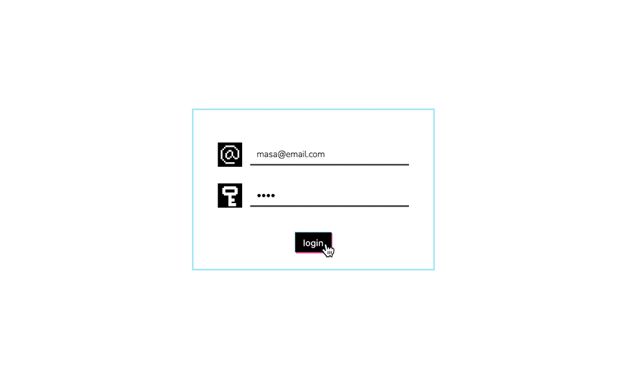
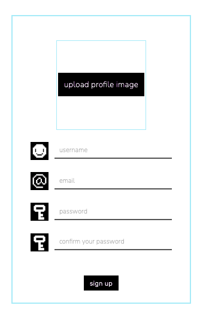
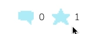
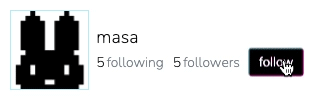
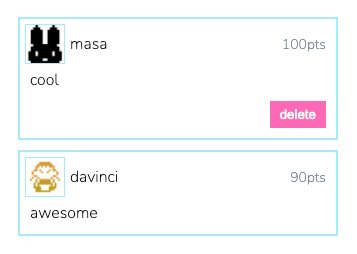
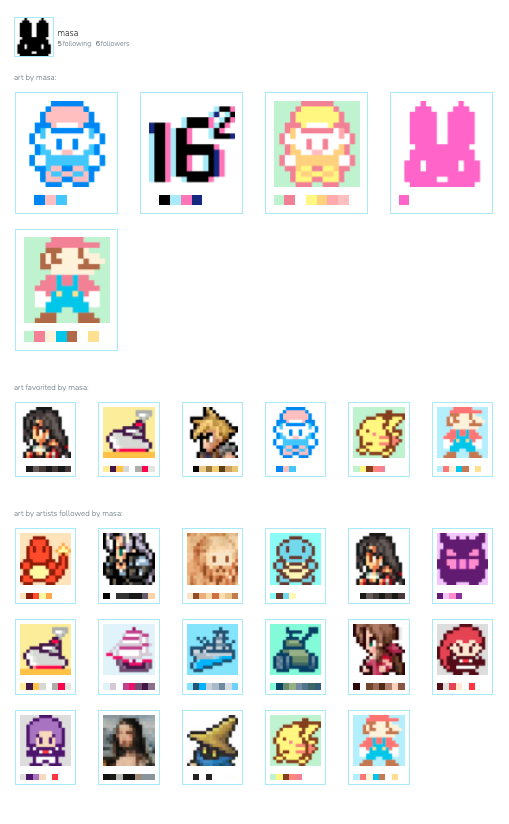
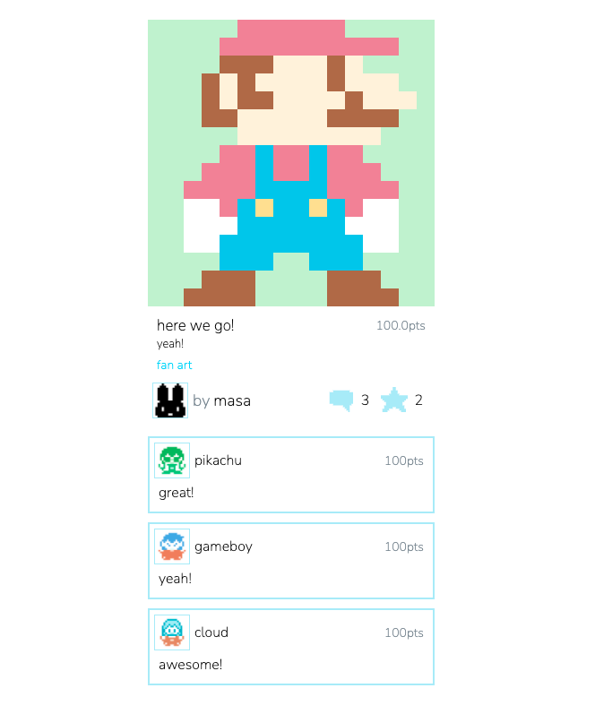
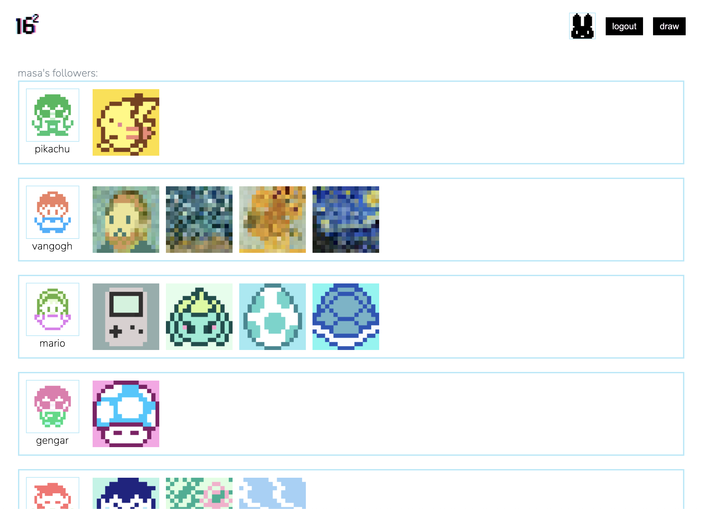
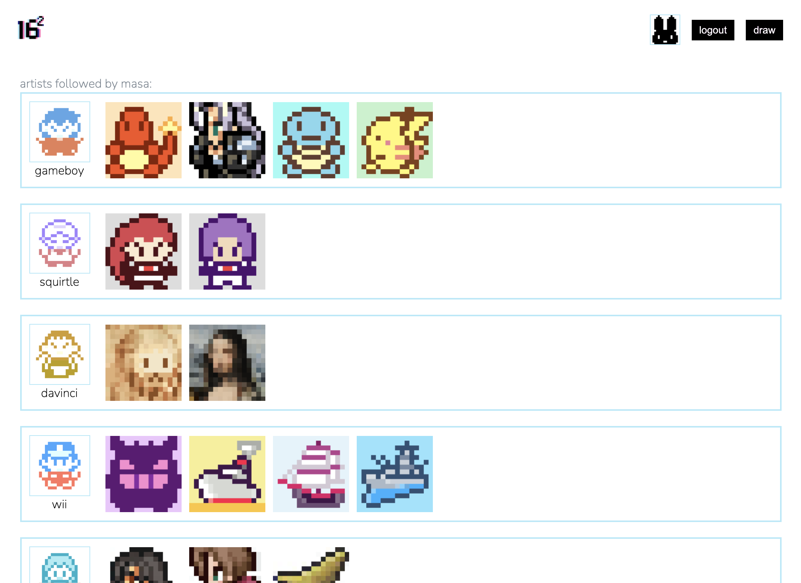
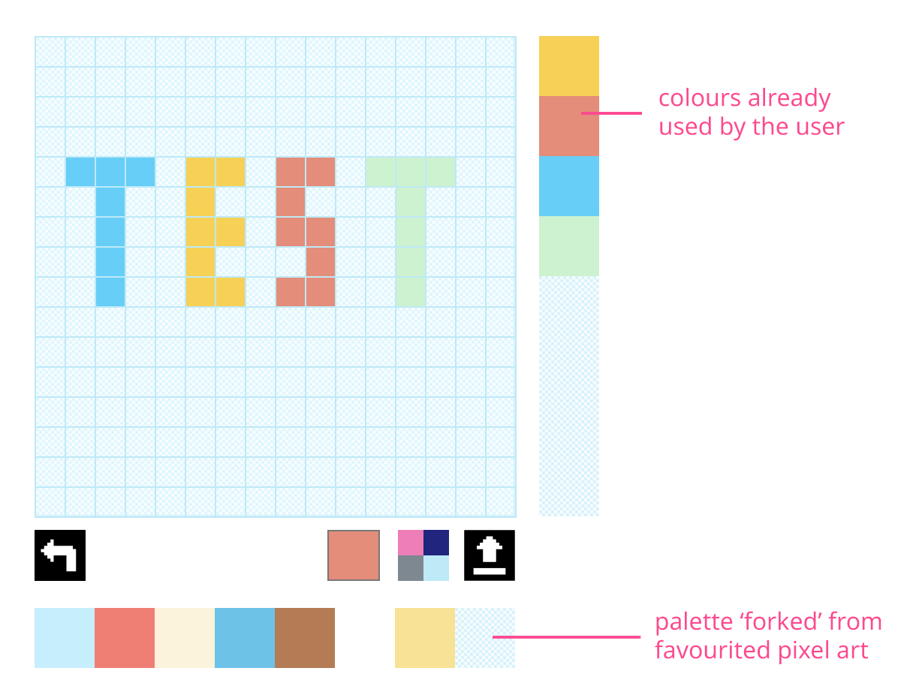

# Project 4: Sixteensquared

## Index
* [Overview](./README.md#overview)
* [Brief](./README.md#brief)
* [Technologies Used](./README.md#technologies-used)
* [Approach](./README.md#approach)
	* [ERD Diagram](./README.md#erd-diagram)
	* [Mockup](./README.md#mockup)
	* [Testing the Drawing Functionality](./README.md#testing-the-drawing-functionality)
	* [Storing the Drawing on the Database](./README.md#storing-the-drawing-on-the-database)
	* [Recording the Hex Colour Codes](./README.md#recording-the-hex-colour-codes)
  * [Setting up the Back End](./README.md#setting-up-the-back-end)  
    * [User Model](./README.md#user-model)
    * [Pics and Categories Model](./README.md#pics-and-categories-model)
    * [Comments Model](./README.md#comments-model)
  * [Building the Front End](./README.md#building-the-front-end)
    * [User Registration and Login](./README.md#user-registration-and-login)
    * [Favouriting](./README.md#favouriting)
    * [Connecting the Pages with Database Relationships](./README.md#connecting-the-pages-with-database-relationships)
  * [Other Drawing Functions](./README.md#other-drawing-functions)  
    * [Image Upload and Pixelation](./README.md#image-upload-and-pixelation)
    * [Forking](./README.md#forking)
    * [Continuous Line and Remove Fill](./README.md#continuous-line-and-remove-fill)
    * [Colour Palettes](./README.md#colour-palettes)
* [Notable Bugs](./README.md#notable-bugs)  
* [Final Thoughts](./README.md#final-thoughts)
	* [Wins and Challenges](./README.md#wins-and-challenges)
	* [Key Learnings](./README.md#key-learnings)

<br />
<br />

Click [here](https://sixteensquared.herokuapp.com/) to see project.


(* I have used American spelling for 'favourite' and 'color' through out the code for the website. This is because the coding language itself uses American spelling, for example 'color' in CSS. In this README I will be using the British spelling for these words, except when I am making direct references to codes and/or variables.)


<br/>

## Overview 
This was my final project at General Assembly's Software Engineering Immersive Course, and we were given 7 days to create a full stack website. As well as putting into practice what we had learnt during the course, I decided to use the opportunity to play with the HTML canvas element. 

I had already used the canvas element before to make a simple drawing app, but I was interested in finding out how it could be built in React. Also, for my earlier projects I did not experiment with users following each other, so I wanted to incorporate this feature into this project. For these reasons, I decided to make a website where users can draw and share pixel art.

We had the choice to work in group, or on our own - I decided to work on my own this time, since I have a tendency to lean a lot on the front end when in group. I wanted to make sure I could put together the back end on my own.

<br/>

## Brief
* To build a full-stack application, making our own back end and front end.
* To use a Python Django API, using Django REST Framework to serve data from a Postgres database.
* To build the frontend using React to consume the API.
* The API should have multiple relationships and CRUD functionality for at least a couple of models.


<br/>

## Technologies Used
* HTML5
* HTML5 canvas element
* CSS3 with animation
* JavaScript (ES6)
* Python
* React
* Django
* TablePlus
* Insomnia
* Git
* GitHub
* Google Chrome dev tools
* VScode
* Eslint
* Photoshop
* Illustrator


<br/>


## Approach
### ERD Diagram
As part of our sign off prcess, we had to submit an ERD diagram to illustrate what kind of database we planned to make. Below is what I submitted, made using [quickdatabasediagrams.com](https://www.quickdatabasediagrams.com/). The main models would be for the users, and for the pixel art the users could create on the site. Separate models were planned for the comments users could leave on drawings, and for the drawing categories. 

  <p align="center">
	  
  </p>

<br />

### Mockup
From the early stage, I had a fairly specific idea of what I wanted the project to look like - since my other projects were quite colourful and busy, I wanted to make something simple. 

  <p align="center">
	  
  </p>

  <p align="center">
	  
  </p>

<br />
I really like the 16 x 16 pixel art in old games, so I chose this as the grid size for the pixel art. This led me to make icons used in the website to be also made using 16 x 16 squares. 

   <p align="center">
	  
  </p>

<br />
The working title for the project was 'dotomo' - 'tomo' means 'friend' in Japanese. The concept was that this website would be a friendly community for 'dot artist'. I decided to change the name because I realised that the term 'dot art' was more associated with pointilism (I didn't know this because people in Japan tend to refer to 'pixel art' as 'dot art'). I also wanted to make the logo also fit into a 16 x 16 grid. 

  <p align="center">
	  
  </p>

This led me to settle with the name 'sixteensquared'. I originally thought of a black logo, but later added some blue and pink as I liked the glitchy offset effect it created. 

<br />

## Testing the Drawing Functionality
Before setting up the database in the back end, I spent some time testing if the HTML canvas element would work in the way I had anticipated.

In vanilla JavaScript, I would have used the DOM to refer to a canvas element on the page, so that I could trigger functions to draw on it using `EventListeners`. Having researched, I found that the common approach in React was to use the `useRef` hook to deal with canvas element. 

```js
  const canvas = useRef()
  let ctx = null

  useEffect(() => {
    const canvasEle = canvas.current
    canvasEle.width = canvasEle.clientWidth
    canvasEle.height = canvasEle.clientHeight
    
    ctx = canvasEle.getContext('2d')
  }, [])
  ```

With the above set up, I could just add ` <canvas ref={canvas} />` in my JSX. The set up is triggered using  `useEffect` to make sure the component is mounted first before 'ctx' (context) is defined. 

Once 'ctx' is defined, I could use `ctx.fillRect(<x-coordinate>, <y-coordinate>, <fill width>, <fill height>)` to draw squares on canvas. For example, `ctx.fillRect(30, 40 , 10, 10)` would draw a 10 x 10 square on the canvas, positioned 30px from the left and 40px from the top.

With this method, all I needed was a way to define the x and y coordinate. I figured that the best way to do this was to map a div into grid on the page, then give each divs an `onclick` event. By giving each divs an ID based on it's grid position, it could be used to calculate the x and y coordinate.

So I first mapped out the grid using function below:

```js
  const mapGrid = ()=>{    
    const grids = []
    for (let i = 0; i < 256; i++){
      grids.push(i)
    }
    return grids.map(grid=>{
      return (
        <div key={grid} 
          id={grid}
          className="grid">
          {grid}
        </div>
      )
    })
  }
```

<br/>

This gave me a grid like below (for clarity, I mapped the grid number within each grid as well). 

  <p align="center">
	  
  </p>

To each divs in the grid, I assigned an `onclick` event below — this would draw a black square in the coordinate clicked on the grid. 

The x coordinate can be worked out using modulus — for example, if I clicked 58, `58 % 16` would be 10, which I could multiply by 20px to give me 200px.

The y coordinate can be calculated by dividing the number by 16, and multipliying the answer (rounded down) by 20 — eg, `58 / 16 = 3.625`, and `3 * 20px = 60px`. In other words, 58 would be 60px down.

```js
  const drawSquare = e =>{
    const x = e.target.id % 16 * 20
    const y = Math.floor(e.target.id / 16) * 20
   
    ctx.fillStyle = '#000000'
    ctx.fillRect(x, y, 20, 20)
  }
```  

<br/>
Screen capture below shows the function in action.

  <p align="center">
	  
  </p>

By layering the grid on top of the canvas, the position being clicked and square being filled becomes synced.

 <p align="center">
	  
  </p>

<br/>

I then took this a step further by adding a colour input field which can set the selected colour to state. However, this was where I started encountering issues. This can be seen in the screen capture below. Each time I set a new colour, the canvas rerenders and squares shaded in the previous colour disappears.

 <p align="center">
	  
  </p>

<br />

As a workaround, I added a line in the 'drawSquare' function to set whatever drawn on the canvas to a state variable called 'drawingRecord'. 
```js
  const drawSquare = e =>{
    const x = e.target.id % 16 * 20
    const y = Math.floor(e.target.id / 16) * 20

    ctx.fillStyle = drawSetting.color
    ctx.fillRect(x, y, 20, 20)
    setDrawingRecord(canvas.current.toDataURL())
  }
```

I then added a useEffect which would redraw the drawn image onto the canvas each time the fill colour and/or the 'drawingRecord' was updated. The canvas image was stored in the 'drawingRecord' as Base64 data, which could be redrawn using the `drawImage()` method. This ensured that the shaded squares persisted even when the fill colours were changed.

```js
 useEffect(() => {
    if (drawingRecord) {
      const image = new Image()
      image.onload = function() {
        ctx.drawImage(image, 0, 0)
      }
      image.src = drawingRecord
    }
  }, [drawSetting, drawingRecord])
```

<br/>

### Storing the Drawing on the Database

Once I had the basic drawing functionality working, I had to figure out how to store it on the database. The first idea I had was to send the image to Cloudinary, retrieve the image URL from Cloudinary, then send this to the database. I was keen to try this out because I had read in the Cloudinary documentation that you could upload images as Base64 data. 

Below is the function, and it worked! The image drawn on the canvas was indeed sent to Cloudinary, so became accessible via it's generated URL.

  ```js
  const handleUpload = async () => { 
    const can = canvas.current.toDataURL('image/png')
    const data = new FormData() 
    data.append('file', can)
    data.append('upload_preset', uploadPreset)
    const res = await axios.post(uploadUrl, data)
    setDrawingUrl(res.data.url)
  }
  ```

  <p align="center">
	  
  </p>

  <br />

  Once I had the image URL, it could be easily displayed again on the website.

  <p align="center">
	  
  </p>

<br/>
However, I settled on recording the image both as canvas-generated png and as a stringified array of hex colour codes, since I felt it gave me more freedom for manipulation later down the line. Also, I found that redrawing the image onto the canvas from the Cloudinary URL caused the canvas to 'taint'. Screenshot below shows the error message I saw when I tried to render the canvas with the Cloudinary URL. Apparently this is a 'securityError', since the image could have come from anywhere.

 <p align="center">
	  
  </p>

<br />

### Recording the Hex Colour Codes

To record the hex colour codes, I first made an array of 256 blank strings:

```js
  const [dots, setDots] = React.useState(Array(256).fill(''))
```

<br />
Then, it was a case of adding lines below into the drawing function, pushing the hex code into the relevant index of the dots array, setting it to state.

```js
dots[e.target.id] = drawSetting.color
setDots(dots)
```

<br />

This would give me an array like below. I was able to send this to the database as strings by using `JSON.stringify()`. To use the data again, it can changed back to an array with `JSON.parse()`.

 <p align="center">
	  
  </p>

<br/>

Once I had this array, I realised that I could draw without using canvas by replacing ` ctx.fillRect(x, y, 20, 20)` with `e.target.style.backgroundColor = drawSetting.color`. This was a lot simpler because I didn't even have to specify the coordinate. Also, if the grid was rerendered due to any change on the page, the divs could be recoloured by referring to the hex codes stored in the 'dots' array:

```js
const drawIntoGrid = (sourceDots, target) =>{
  sourceDots.forEach((dot, i)=>{
    target.current.children[i].style.backgroundColor = dot
  })
}
```
<br />
I also had the idea to store the colour palette of the image on the database. The colour palette would be derived from the 'dots' array by sorting the hex codes in order of prevalence, then removing duplicates. 

```js
const sortedByFrequencyDuplicatesAndBlankRemoved = array =>{  
  const countOccurrences = (arr, val) => arr.reduce((a, v) => (v === val ? a + 1 : a), 0)
  const blankRemoved = array.filter(dot=> dot !== '' && dot)
  const orderedByFrequency = blankRemoved.map(ele=>{  
    return `${ele}_${countOccurrences(blankRemoved,ele)}`
  }).sort((a, b) => b.split('_')[1] - a.split('_')[1])  
  return [ ...new Set(orderedByFrequency.map(ele=>ele.split('_')[0]))]
}
```
<br />
For simplicity, I also limited the palette to 8 colours with the function below:

```js
  const filterPalette = arr =>{
    const palette = Array(8).fill('')
    for (let i = 0; i < 8; i++){
      palette[i] = sortedByFrequencyDuplicatesAndBlankRemoved(arr)[i]
    }
    return palette
  }
```  
<br />
Having the data for the colour palette allowed me to map them onto various part of the website, like below:
 <p align="center">
	  
  </p>

Arguably, I no longer needed the canvas, since I could draw with the divs and redraw the images with the hex colour code. However, I left the canvas in since having the URL for png image was useful for rendering thumbnail images.

<br/>

### Setting up the Back End

Once I tested the basic drawing functionality and identified what kind of data I wanted on the database, I worked on setting up the back end.

<br />

#### User Model

After setting up the boiler-plate Django, the first thing I set up was the user model. I used the default user model that comes with Django, but made slight customisation. I eventually added a many-to-many relationship to itself to add the 'followed_by' and 'following' field, but made no other changes since the Django user model came complete with enough features, including password verification.

```python
from django.db import models
from django.contrib.auth.models import AbstractUser

class User(AbstractUser):
    email = models.CharField(max_length=50, unique=True)
    profile_image = models.CharField(max_length=300)
```    
<br />

#### Pics and Categories Model

The drawings to be stored on the database had the following model:

```python
from django.db import models

class Pic(models.Model):
    title = models.CharField(max_length=50)
    image = models.CharField(max_length=300)
    description = models.TextField(max_length=200, null=True, blank=True)
    dots = models.TextField(max_length=3100)
    color_palette = models.TextField(max_length=100)
```    
<br/>

I eventually added relationships below to this model. I made another model for categories, which simply had a field for the category name (the ID would be defined automatically by Django). To keep the project simple, I didn't add a functionality to enable user to add their own category this time. Users could also 'like' the pixel art, and this would be stored in the database as 'favourited_by'.

```python
    categories = models.ManyToManyField(
        "categories.Category",  
        related_name="pics"
    )  
    artist = models.ForeignKey(
        "jwt_auth.User",
        related_name="created_pic",
        on_delete=models.CASCADE
    )
    favorited_by = models.ManyToManyField(
        "jwt_auth.User",
        related_name="favorited_pic",
        blank=True
    )
```

<br />

The functionality for favouriting the pixel art was defined in the 'views.py'. I was going to change the icon displayed on the front end depending on if the pixel art was favourited or not, so I settled with having separate definitions for 'favouriting' and 'unfavourtiting' (alternative would have been to have one definiton to control both, which would require some kind of control flow to determine which would be triggered).

```python
class PicFavoriteView(PicDetailView):

    permission_classes = (IsAuthenticated, )

    def post(self, request, pk):
        pic_to_favorite = self.get_pic(pk=pk)
        pic_to_favorite.favorited_by.add(request.user.id) 
        pic_to_favorite.save()
        serialized_favorited_pic = PopulatedPicSerializer(pic_to_favorite)
        return Response(serialized_favorited_pic.data, status=status.HTTP_201_CREATED)


    def delete(self, request, pk):
        pic_to_unfavorite = self.get_pic(pk=pk)
        pic_to_unfavorite.favorited_by.remove(request.user.id) 
        pic_to_unfavorite.save()
        serialized_favorited_pic = PopulatedPicSerializer(pic_to_unfavorite)
        return Response(serialized_favorited_pic.data, status=status.HTTP_204_NO_CONTENT)        
```
<br />

#### Comments Model

Comments were given its own model, then hooked up with the users and pics models with one-to-many relationship.

```python
class Comment(models.Model):
    text = models.TextField(max_length=200)
    rating = models.PositiveIntegerField()
    created_at = models.DateTimeField(auto_now_add=True)
    pic = models.ForeignKey(
        "pics.Pic",
        related_name="comments",
        on_delete=models.CASCADE
    )
    owner = models.ForeignKey(
        "jwt_auth.User",
        related_name="posted_comments",
        on_delete=models.CASCADE
    )
```    

<br />
I spent one whole day setting up the back end, testing as I went using Django's inbuilt admin page and insomnia. Once the back end was functional, I set up React to work on the front end - once I moved onto this stage I only made minor tweaks in the back end, mainly to alter what data was visible from where by changing the settings on the serializers. 

I was able to create seed data for users using Google Sheets and load them with `python manage.py loaddata jwt_auth/seeds.json` command. However, the seed data for pixel art was tricker to produce, since it needed the hex colour code arrays. So I made the pixel art data by actually drawing them on the website. I was able to speed up this process thanks to some functionality I added, but I will explain this in the [Other Drawing Functions](./README.md#other-drawing-functions) section.
<!-- Due to the nature of Django, it was easier to set up compared to Mongo and Express, however I did find that there were less freedom with Django's seeding process. -->

 <p align="center">
	  
  </p>

<br />

### Building the Front End

With the back end put into place, I worked on the front end. Since the drawing functionality was already tested in advance, I was able to hook this up to the back end with relative ease. Drawing would be sent to the database as a stringified array of hex colour code as part of the formdata, along with the image URL generated with Cloudinary, using axios post request below:

```js
function createPic(formdata){
  return axios.post(`${baseUrl}/pics/`,formdata)
}
```

<br />
I had plans to add further drawing related features, but decided to focus first on the social aspect of the website - the functionality to allow users to favourite pixel art, add comments, and follow other users. To work on these functionality, I needed to be able to login to the website. I could have used Insomnia to simulate this, but I felt it would be useful to have the feature on the website early on.

<br />

#### User Registration and Login

I tend to favour rounded border radius and squishy animation effects using `transform: scale`, but decided to keep the design sharp and square this time, since the site was about pixel art. I kept the form design simple, with each input field represented by an icon (since the icon on its own may not be obvious, I labelled each field using placeholders). I had a concept of a square sliding in and transforming into the form. I achieved this with the following keyframe animation:

```css
@keyframes form_load {
  0% {
    border: 2px solid black;
    background-color: black;
    left: -200vh;
    height: 0;
    width: 0;
    padding: 10px;
  }
  40% {
    left: 30vh; 
    width: 0;
  }
  60% {
    left: 0vh; 
    width: 300px;
  }
  61% {
    border: black;
    background-color: black;
  }
  80% {
    border: #b2eaf9;
    background-color: white;
    height: 0;
    padding: 10px 20px;
  }
  100% {
    border: 2px solid #b2eaf9;
    background-color: white;
    left: 0vh; 
    padding: 30px 20px 20px 20px;
    height: 200px;
    width: 300px;
  }
}
```
<br />
Having played around with keyframe animations, I realised you could use pretty much any css property to animate. I think this was the first time I changed the padding using the animation. Pretty much every property for this css class were defined in the final keyframe. It meant I had to edit the animation each time I wanted to restyle this class, however I felt it was worth the hassle. The result can be seen in the screen capture below:

 <p align="center">
	  
  </p>

<br />
Since the form came in from the left when it was loaded, I felt it would be natural to make it slide out of the page again when the user successfully logged in. I decided to jazz up this animation by animating other random squares slide together with the form. Screen capture below shows what I mean:

   <p align="center">
	  
  </p>

<br />
This was done by mapping out square divs onto the page with random positions. They would start off invisible with the `opacity` set to 0.

```css
.wrapper {
  .color_block_container {
    height: 20px;
    width: 20px;
  }
  
  .color_block {
    height: 100%;
    width: 100%;
    animation: none;
    opacity: 0;
    transition: 0.5s;
  }
}
``` 
<br />
On successful login, class 'animate' is added to the wrapper - this triggers all divs with the class 'class_block' to be animated with the 'slide' keyframe. Controlling the animation by toggling classes on the parent div saved me from attaching new classes to each child divs, which would have required some sort of loop. With this animation I also altered the width of the div, which creates the illusion of the divs blurring due to high speed.

```css
.wrapper.animate {
  .color_block {
    position: relative;
    animation: slide forwards ease 1s;
  }
}

@keyframes slide{
  0% {width: 100px; margin-left:-100vh; opacity: 0}
  40% {margin-left:-20px; width: 100%; opacity: 1}
  70% {width: 100%; margin-left:0}
  100% {width: 2000px; margin-left: 100vh;}
}
```

<br />
The buttons were given hover effects inspired by the glitchy offset effect which I had applied to the website logo. This was achieved by applying separate keyframe animation to pseudo elements. The pseudo elements were coloured in blue and pink, but were only visible during the hover animation because they were styled with `  mix-blend-mode: color-burn`.

   <p align="center">
	  
  </p>

```css
button:hover {
  animation: offset_zero 0.5s infinite;
}

button:hover::before {
  animation: offset_one 0.5s infinite;
}

button:hover::after{
  animation: offset_two 0.5s infinite;
}

@keyframes offset_zero {
  0%{transform: translate(0);}
  50%{transform: translate(0, -2px);}
  100%{transform: translate(0);}
}

@keyframes offset_one {
  0%{transform: translate(0);}
  50%{transform: translate(-5px, -5px);}
  100%{transform: translate(0);}
}

@keyframes offset_two {
  0%{transform: translate(0);}
  50%{transform: translate(5px, 5px);}
  100%{transform: translate(0);}
}

```

<br />

Similar styling and animation were applied to the registration form. Since the form was bigger than the login form, the keyframe animation was tweaked to accomodate this.

   <p align="center">
	  
  </p>

<br />

#### Favouriting

With the login functionality set up, it was easier to test the various social interaction features. The favouriting functionality would work by recording the logged in user's ID in the 'pics model' database under the 'favorited_by' field. I figured it would be intuitive if favouriting and unfavouriting could be done with the same button, with the button being coloured differently to indicate if it has been favourited already or not. I displayed the number of favourites next to the button to make this even more obvious.

   <p align="center">
	  
  </p>

 As mentioned earlier, I had made separate definitions in the back end to trigger favouriting and unfavouriting - I controlled this by assigning these definitions to different buttons. Although the user only sees one button, a different button is actually displayed using a ternary operator below:

```js
 !like ?
  <div 
    className="menu_button"
    onClick={handleFavorite}
  >
    
  </div>  
  :
  <div 
    className="menu_button clicked"
    onClick={handleUnFavorite}
  >
    
  </div>  

```
<br />
While building, I intially encountered a problem where the result of the button was not reflected until the page was refreshed (ie, the button did trigger the favouriting, but the result only reflected after refresh). This threw me for a while, but I was able to resolve by having the favouriting function update a 'likedNow' state, which I included in the dependency array for the `useEffect` below. 

```js
  React.useEffect(() => {
    const getData = async () => {
      try {
        const { data } = await getSinglePic(id)
        setPic(data)

      } catch (err) {
        console.log('error')
        setError(true)
      }
    }
    getData()
  },[id, likedNow])
```  

By doing this, the website would re-request data from the back end each time the favourite button was clicked, triggering a rerender. 

Similar approach worked for the follow/unfollow button. 

   <p align="center">
	  
  </p>

I also did something similar for the commment button, but instead of toggling it with uncomment button, I switched it with a greyed-out button to indicate that no more comments could be added (users could only add one comment to each pixel art). 

   <p align="center">
	  
  </p>

This was done by having the website check if any of the existing comments were made by the user viewing the page. 
```js
  const commentedByUser = arr => {
    return arr.comments.filter(comment=>{
      return comment.owner.id === userId
    }).length > 0
  }
```

<br />
Once this was determined, it could be used to dictate which buttons would be displayed (the comment button would also be greyed out if the user was not logged in).

```js
 {!userId || commentedByUser(pic) ?
    <div className="menu_button inactive">
      
    </div> 
    :
    <div className="menu_button"
      onClick = {displayCommentForm}
    >
      
    </div> 
  }                
```

<br />
The comment can be deleted by clicking the delete button, which would only be displayed if the user's id matched the comment owner's id (ie, users can only delete their own comments):

   <p align="center">
	  
  </p>

<br/>

#### Connecting the Pages with Database Relationships

I had set up the back end so that the website could request data of all the drawing made by a particular user. Using this, I made a user profile page, displaying that user's work. It also had a section displaying art favourited by the user, and another section for arwork created by other users followed by the user.

  <p align="center">
	  
  </p>

<br />
Clicking the artwork would take you to the page showing the artwork on its own, displayed along with any comments added. Each user icon displayed on these page can be clicked through to show that user's feed, which would display their work, any art they have favourited and so on. Clicking on the category underneath the artwork would display a other artwork with the same category, so this is another way to find more pixel art.

  <p align="center">
	  
  </p>

<br />
I also made a separate page to display a user's follower by clicking on 'followers' link on the top of the profile page. This displays a list of users with selection of their artwork - these are also links, so users can explore the website and find even more users and artwork through this page.

   <p align="center">
	  
  </p>

<br />
Similar page was also made to dislay users followed by any given user - in other words, the website offers users the opportunity navigate around the website from various angle, made possible with the various relationships linking the database.

   <p align="center">
	  
  </p>

<br/>

### Other Drawing Functions

Having created the functionalities to enable users to share and interact with each other, I added further functionality for creating pixel art.

There were two features I was keen to build - feature enabling users to upload files from their desktop, and feature to enable user to 'fork' someone else's artwork.

<br />

#### Image Upload and Pixelation

While creating sample pixel art to populate the website, I felt it would be useful to add a feature to upload images, rather than limiting the user to create the artwork on the website. Even better, if a non-pixel art image could be uploaded and converted to pixel image, it could help users new to pixel art. I researched ways to approach this, and came up with the following solution.

First, I made the function below, tied to an file input field. It converts uploaded file to a 'blob URL' and sets it to state.

```js
  const mapFromImage = e => {
    if (!e.target.files[0]) return
    const uploadedImage = e.target.files[0]
    const blobUrl = window.URL.createObjectURL(uploadedImage)
    setUploadedImageBlobUrl(blobUrl)
  }

```

<br />
The blob URL set to state then triggers an `useEffect` below. The blob URL is assigned to an image created with the `Image()` constructor, then written onto the canvas using `drawImage()`. Once this is done, the drawing can be read using `getImageData()` - with this function, you can convert images into pixel data by specifying the coordinate and area of the image to be sampled. I created a loop to sample pixel data of the uploaded image, referencing 256 coordinates. The array of 256 colour codes were then used to colour the grid, thus converting the uploaded image into a pixel art. 

```js
  React.useEffect(() => {
    if (!uploadedImageBlobUrl) return

    setUpCanvas()

    if (uploadedImageBlobUrl) {
      const image = new Image()
      image.onload = function() {    

        ctx.drawImage(image, 0, 0, 320, 320)
        const dotsFromImage = []

        for (let i = 0; i < 256; i++) {
          const y = Math.floor(i / 16) * 20
          const x = i % 16 * 20
          const c = ctx.getImageData(x + 5, y + 5, 1, 1).data
          const hex = '#' + ('000000' + rgbToHex(c[0], c[1], c[2])).slice(-6)
          dotsFromImage.push(hex)
        }
        setDots(dotsFromImage)
        drawIntoGrid(dotsFromImage,drawingGrid)
      }
      image.src = uploadedImageBlobUrl
    }
  }, [uploadedImageBlobUrl])
```
<br />
The catch was that the `getImageData()` returns a UintClampedArray, which is an array of rgba colour codes. What I needed instead was hex colour code. Fortunately, this was a common problem, so there were abundance of solutions online. I found a nice snippet below on [this Stack Overflow thread](https://stackoverflow.com/questions/6735470/get-pixel-color-from-canvas-on-mousemove) which worked perfectly.

```js
  const rgbToHex = (r, g, b) => {
    if (r > 255 || g > 255 || b > 255)
      throw 'Invalid color component'
    return ((r << 16) | (g << 8) | b).toString(16)
  }
```  

<br />
The function accepts each of the rgb value as the argument, so it is was combined with the `getImageData()` in the following manner:

```js
  const c = ctx.getImageData(x + 5, y + 5, 1, 1).data
  const hex = '#' + ('000000' + rgbToHex(c[0], c[1], c[2])).slice(-6)
```
<br />
Finally, since `ctx.drawImage(image, 0, 0, 320, 320)` would distort the image if the user uploaded something that was not square, I replaced it with the following lines. This would keep the natural ratio of the image, and crop any excess instead. I used a conditional flow to determine where to crop, depending on if the image is landscape or portrait.

```js
    const width = image.naturalWidth 
    const height = image.naturalHeight 
    if (width < height){
      canvas.current.setAttribute('width', 320)
      canvas.current.setAttribute('height', 320 * (height / width)) 
      ctx.drawImage(image, 0, 0, 320, 320 * (height / width))
    } else {
      canvas.current.setAttribute('width', 320 * (width / height))
      canvas.current.setAttribute('height', 320) 
      ctx.drawImage(image, 0, 0, 320 * (width / height), 320)
    }
```      

<br />
Screen capture below shows this functionality in action:


   <p align="center">
	  
  </p>

Once rendered, the uploaded image can be edited by the user by clicking on each squares.


<br />

#### Forking

What if users could load any image they had favourited, and make their own copy which could be edited freely? This idea was inspired by the forking functionality in GitHub. The solution was surprisingly simple compared to the image upload feature explained earlier.

Since I already had the function for mapping images using array of hex codes ('drawIntoGrid()'), I just needed a way to retrieve the array from the database so that I could pass it on this function.

```js
  const fork = forkedDots =>{
    drawIntoGrid(JSON.parse(forkedDots),drawingGrid)
    setDots(JSON.parse(forkedDots))
  }
```
<br />
I achieved this by mapping out the array containing user's favourited image. Within the mapping function,  I assigned the 'fork' function mentioned above to the `img` element, which allowed me to pass the array of hex code relating to the image directly to the function. I made a similar function for the colour palette as well, allowing users to load palettes relating to images they had favourited.

```js
  const mapOptions = arr =>{
    return arr.map(pic=>{
      return (
        <div key={`p${pic.id}`}
          className="palette_wrapper"
        >
          //* fork function assigned to each img elements
          fork(pic.dots)}
            src={pic.image} alt={pic.title}
          />  
          <div onClick={()=>{
            setDisplayPalette(false)
            setPalette(JSON.parse(pic.colorPalette))
          }}
          className="palette_option"
          >
            {mapFavoritedPalette(pic)}
          </div>  
        </div>
      )
    }
    )
  }
```

<br />
Screencapture below shows this feature in action:

  <p align="center">
	  
  </p>

<br />

#### Continuous Line and Remove Fill

While using the drawing interface, I felt it would be easier to draw if I could click and drag the mouse cursor to create a line rather than clicking each squares individually. I enabled this by introducing a state variable called 'draw' which is turned either `true` or `false`, toggled by `onMouseDown` and `onMouseUp`:

```js
  const drawOn = ()=> setDraw(true) 
  const drawOff = ()=> setDraw(false)
```

```js
<div className="grid_wrapper"
  onMouseDown={drawOn}
  onMouseUp={drawOff}
  ref={drawingGrid}
> 
 //* ... mapped grid and canvas ... */
</div>
```

<br />
The 'draw' state would determine if the mouse stroke would trigger the squares to be coloured or not. In other words, users can draw by moving the mouse while clicked down, and stop drawing by releasing the mouse.

```js
  const drawDot = e =>{
    if (!draw) return
    e.target.style.backgroundColor = drawSetting.color
    dots[e.target.id] = drawSetting.color 
    setDots(dots)
  }
```

<br />
Even with the above added, I left in the drawing function triggered by clicking each squares, since users may want to draw bit by bit as well. Also, I enabled users to remove fill colour by clicking on the square that is already filled. This is simply done by having the function check if the square has a `backgroundColor` already or not.

```js
const drawDotClick = e =>{
  const color = e.target.style.backgroundColor === '' ? drawSetting.color : ''
  e.target.style.backgroundColor = color
  dots[e.target.id] = color
  setDots(dots)
}
```  

<br />
Screen capture below shows these two functionalities in action:

  <p align="center">
	  
  </p>

<br />

#### Undo

I also attempted a function allowing users to undo what they have done. It works by setting to state the array of hex codes each time the user draws - this essentially creates an array of an array. Clicking the back button would fire the function which references the last recorded array of hex codes, and renders it on the grid. 

  <p align="center">
	  
  </p>

It works fine for undoing few steps, but I found it buggy when I used it repeatedly on large number of steps - this seems to be because the recorded array keeps track of everything, including any mistakes that were undone. In other words, the undo button would sometimes undo a step where the user undid something (very confusing...) Due to time constraint I did not refine this any further, but would be nice to revisit this feature at some point.

<br />

#### Colour Palettes

The final feature I would like to touch on is the colour palettes - the colour used on the grid is recorded each time the user draws. Users can reuse a colour they have already used by clicking these palettes. Users can also select colours from the palette 'forked' from a drawing they have favourited.

  <p align="center">
	  
  </p>

<br />

## Notable Bugs

There were many small bugs I encountered during production, but there was one significant bug I found relating to image upload. 

After the user creates or edit a pixel art and click on the submit button, it takes a short while for the submission to go through. This is because in the background, the data from canvas is first uploaded to Cloudinary, then the site requests the URL of the uploaded image from Cloudinary so that it can be passed onto the database.

Originally, there was a bug where the user could continue to submit images while the site was communicating with Cloudinary. This would happen if the user clicks on the submission button repeatedly while the image upload was taking place. To test how bad the issue was, I clicked the button as many times as I can, and managed to upload the same image 9 times - obviously not good!

To fix this issue, I added a step to the upload function to add 'deactivate' class to the button. While the button has this class, the function will no longer fire when you click it. The 'deactivate' class is only removed if the submission fails, for example due to incomplete form detail (if the submission is successful, re-activation is no longer necessary because the user will be taken to a different page anyway).

<br />

## Final Thoughts
### Wins and Challenges
I had a lot of fun working on this project, as I was able to play with the HTML canvas element and gain insight into how images are rendered and manipulated using drawing softwares. There were many more directions I could have taken, such as function to apply filter to the image by manipulating the hex codes (eg changing the image to black and white, or inverting colours). 

In terms of dealing with the database, I felt I was doing a lot of heavy lifting in the front end, since I am currently more comfortable working with React and JavaScript compared to Python and Django. I think I could have changed the structure of the database to make it easier to retrieve what I needed in the front. This is something I could work on in the future. 

<br />

### Key Learnings
I feel I was able to take my animation skills even further with this project, by acquainting myself with the `useRef` hook. I struggled when I moved from vanilla JavaScript to React since some of my techniques using the DOM could not be used as is. When I realised that you could call direct reference to elements using  `userRef` and refer to each of its child elements with `.children[i]`, it opened up a lot of possibilities, which I explored when I made the animation for the Home page, shown below:

  <p align="center">
	  
  </p>

In retrospect, I feel there is quite a lot of refactoring that could be done as there are similar components and functionality with slight variation, which I may be able to tweak to reuse rather than repeat.

Overall, I believe the project help me level up rapidly, since it gave me an opportunity to think about and work on every aspect of the website.

Click [here](https://sixteensquared.herokuapp.com/) to see project.