# Project 4: Sixteensquared

## Index
* [Overview](./README.md#overview)
* [Brief](./README.md#brief)
* [Technologies Used](./README.md#technologies-used)
* [Approach](./README.md#approach)
	* [Mock Up](./README.md#mock-up)
	* [Requesting Data from the API](./README.md#requesting-data-from-the-api)
	* [Displaying Details of Individual Pokémon](./README.md#displaying-details-of-individual-pokémon)
	* [Styling and Animation](./README.md#styling-animation)
    * [Background](./README.md#background)
    * [Hover Effects](./README.md#hover-effects)
    * [Animation for Pokémon Entering the Page](./README.md#animation-for-pokémon-entering-the-page)
* [Final Thoughts](./README.md#final-thoughts)
	* [Wins and Challenges](./README.md#wins-and-challenges)
	* [Key Learnings](./README.md#key-learnings)


(Click [here](https://sixteensquared.herokuapp.com/) to see project)


(* I have used American spelling for 'favourite' and 'color' through out the code for the website. This is because the coding language itself uses American spelling, for example 'color' in CSS. In this Read Me I will be using the British spelling for these words, except when I am making direct references to codes and/or variables)


<br/>

## Overview 
This was my final project at General Assembly's Software Engineering Immersive Course - we were given 7 days to create a full stack website. As well as putting into practice what we had learnt during the lesson, I decided to use the opportunity to develop my personal experiment using canvas. 

I had already worked with HTML 5 canvas element to make a simple drawing app, but I was interested in finding out how it could be built in React. Also, for my earlier projects I did not experiment with users following each other, so I wanted to incorporate this feature into this project. With these thoughts in mind, I decided to make a website where users can draw and share pixel art.

We had the choice to work in group, or on our own - I decided to work on my own this time, since I have a tendency to lean a lot on the frontend when in group. I wanted to make sure I could put together the backend on my own.

<br/>

## Brief
* To build a full-stack application, making our own backend and frontend
* To use a Python Django API, using Django REST Framework to serve data from a Postgres database
* To build the frontend using React to consume the API
* The API should have multiple relationships and CRUD functionality for at least a couple of models


<br/>

## Technologies Used
* HTML5
* HTML5 canvas element
* CSS3 with animation
* JavaScript (ES6)
* Python
* React
* Django
* TablePlus
* Insomnia
* Git
* GitHub
* Google Chrome dev tools
* VScode
* Eslint
* Photoshop
* Illustrator


<br/>


## Approach
### ERD Diagram
As part of our sign off prcess, we had to submit an ERD diagram to illustrate what kind of database we planned to make. Below is what I submitted, made using [quickdatabasediagrams.com](https://www.quickdatabasediagrams.com/). The main models would be for the users, and a model for the pixel art the users could create on the site. A separate model was planned for the comments users could leave on drawings, and for the drawing category. 

  <p align="center">
	  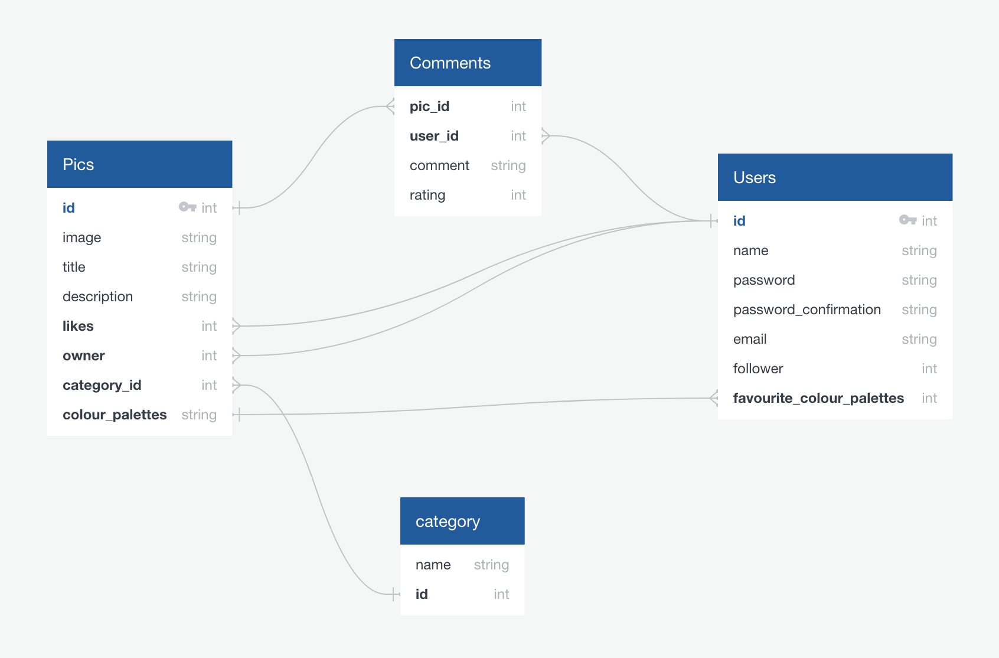
  </p>

### Mock Up
From early stage, I had a fairly specific idea of what I wanted the project to look like - since my other projects were quite colourful, I wanted to make something sleek and simple, with limited colour palette. 

  <p align="center">
	  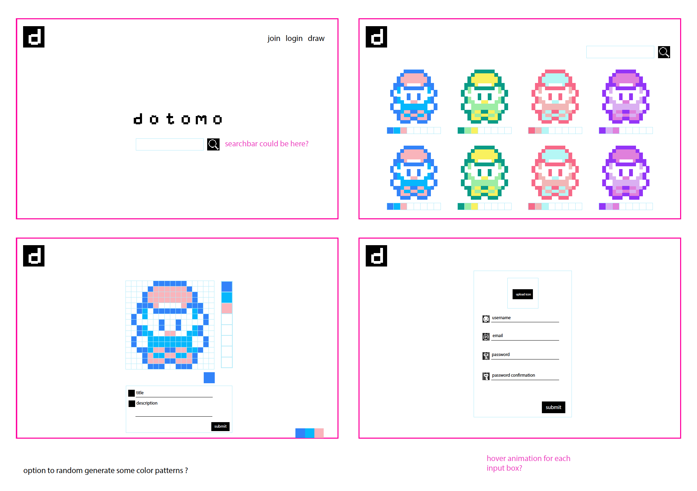
  </p>

  <p align="center">
	  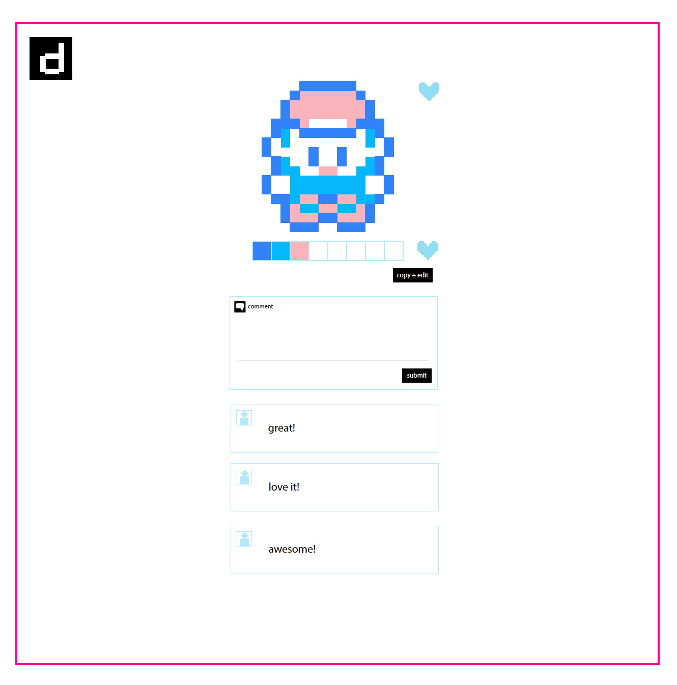
  </p>

I really like the 16 x 16 pixel art in old games, so I chose this as the grid size for the canvas drawing. This led me to make icons used in the website to be also made using 16 x 16 squares. 

   <p align="center">
	  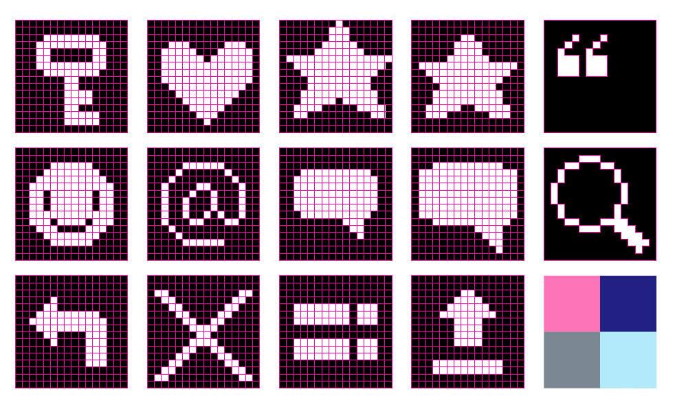
  </p>

The working title for the project was 'dotomo' - 'tomo' means 'friend' in Japanese, so the concept was that this would be a friendly community for 'dot artist'. I changed this for several reasons - the name needed some explanation, and also I realised that the term 'dot art' was more associated with pointilism (people in Japan tend to refer to 'pixel art' as 'dot art'). I also wanted to make the logo also fit into a 16 x 16 grid. 

  <p align="center">
	  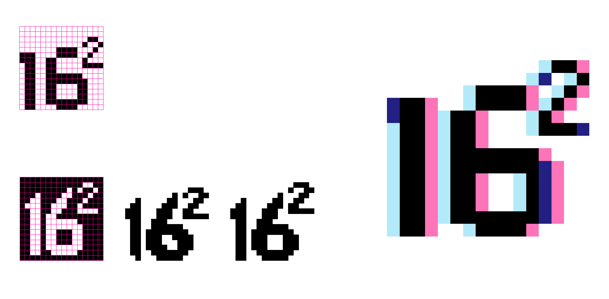
  </p>

This led me to settle with the name 'sixteensquared'. I originally thought of a black logo, but later added some blue and pink as I liked the glitchy offset effect it created. 

<br />

## Testing the Drawing Functionality
Before setting up the database in the backend, I spent some time testing if the HTML canvas element would work in the way I anticipated.

In vanilla JavaScript, I would have used the DOM to refer to a canvas element on the page, so that I could trigger functions to draw on it using 'EventListeners'. Having researched, I found that the common approach in React was to use the `useRef` hook to deal with canvas element. 

```
  const canvas = useRef()
  let ctx = null

  useEffect(() => {
    const canvasEle = canvas.current
    canvasEle.width = canvasEle.clientWidth
    canvasEle.height = canvasEle.clientHeight
    
    ctx = canvasEle.getContext('2d')
  }, [])
  ```

With the above set up, I could just add ` <canvas ref={canvas} />` in my JSX. The set up is triggered using  `useEffect` to make sure the component is mounted first before 'ctx' (context) is defined. 

Once 'ctx' is defined, I could use `ctx.fillRect(<x-coordinate>, <y-coordinate>, <fill width>, <fill height>)` to draw squares on canvas. For example, `ctx.fillRect(30, 40 , 10, 10)` would draw a 10 x 10 square on canvas, positioned 30px from the left and 40px from the top.

With this method, all I needed was a way to define the x and y coordinate. I figured that the best way to do this was to map a div into grid on the page, then give each divs an `onclick` event. By giving each divs an id based on it's grid position, it could be used to calculate the x and y coordinate.

So I first mapped out the grid using function below:

```
  const mapGrid = ()=>{    
    const grids = []
    for (let i = 0; i < 256; i++){
      grids.push(i)
    }
    return grids.map(grid=>{
      return (
        <div key={grid} 
          id={grid}
          className="grid">
          {grid}
        </div>
      )
    })
  }
```

This gave me a grid like below (for clarity, I mapped the grid number within each grid as well). 

  <p align="center">
	  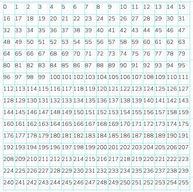
  </p>

To each of divs in the grid, I assigned an `onclick` event below - this would essentially draw a black square in the coordinate clicked on the grid. 

The x coordinate can be worked out using modulus - for example, if I clicked 58, `58 % 16` would be 10, which I could multiply by 20px to give me 200px.

The y coordinate can be calculated by dividing the number by 16, and multipliying the answer (rounded down) by 20 - eg, `58 / 16 = 3.625`, and `3 * 20px = 60px`. In other words, 58 would be 60px down.

```
  const drawSquare = e =>{
    const x = e.target.id % 16 * 20
    const y = Math.floor(e.target.id / 16) * 20
   
    ctx.fillStyle = '#000000'
    ctx.fillRect(x, y, 20, 20)
  }

```  

Screen capture below shows the function in action.

  <p align="center">
	  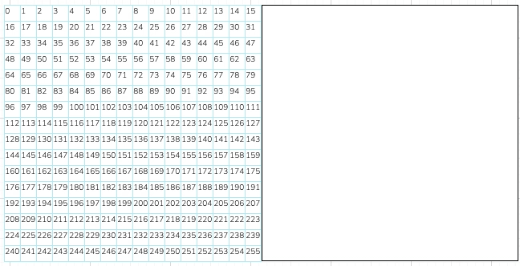
  </p>

By layering the grid on top of the canvas, the position being clicked and square being filled becomes synced.

 <p align="center">
	  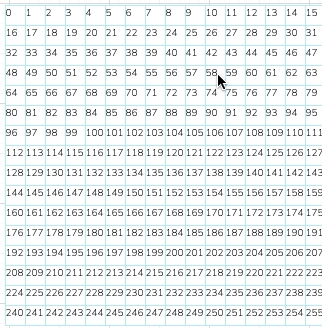
  </p>

I then took this a step further by adding a colour input field which can set the selected colour to state. However, this was where I started encountering issues. This can be seen in the screen capture below. Each time I set a new colour, the canvas rerenders and squares shaded in the previous colour disappears.

 <p align="center">
	  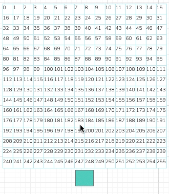
  </p>


As a work around, I added a line in the 'drawSquare' function to set whatever drawn on the canvas to a state variable called 'drawingRecord'. 
```
  const drawSquare = e =>{
    const x = e.target.id % 16 * 20
    const y = Math.floor(e.target.id / 16) * 20

    ctx.fillStyle = drawSetting.color
    ctx.fillRect(x, y, 20, 20)
    setDrawingRecord(canvas.current.toDataURL())
  }

```

I then added a useEffect which would redraw the drawn image onto the canvas each time the fill colour and/or drawingRecord was updated. The canvas image was stored in 'drawingRecord' as Base64 data, which could be redrawn using the drawImage() method. This ensured that the shaded squares persisted even when the fill colours were changed.

 useEffect(() => {
    if (drawingRecord) {
      const image = new Image()
      image.onload = function() {
        ctx.drawImage(image, 0, 0)
      }
      image.src = drawingRecord
    }
  }, [drawSetting, drawingRecord])

<br/>

### Storing the Drawing on the Database

Once I had the basic drawing functionality working, I had to figure out how to store it on the database. The first idea I had was to send the image to Cloudinary, retrieve the image url from Cloudinary, then send this to the database. I was keen to try this out because I had read in the documentation that you could send images as Base64 data to Cloudinary. 

Below is the function, and it worked! The image drawn on the canvas was indeed sent to Cloudinary, so became accessible via it's generated url.

  ```
  const handleUpload = async () => { 
    const can = canvas.current.toDataURL('image/png')
    const data = new FormData() 
    data.append('file', can)
    data.append('upload_preset', uploadPreset)
    const res = await axios.post(uploadUrl, data)
    setDrawingUrl(res.data.url)
  }
  ```

  <p align="center">
	  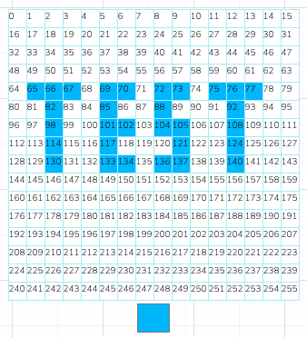
  </p>

  Once I had the image url, it could be easily displayed again on the website.

  <p align="center">
	  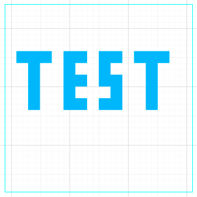
  </p>

However, I settled on recording the image both as canvas-generated png and as a stringified array of hex colour codes, since I felt it gave me more freedom for manipulation later down the line. Also, I found that redrawing the image onto the canvas from the Cloudinary url caused the canvas to 'taint'. Screenshot below shows the error message I saw when I tried to render the canvas with the Cloudinary url. Apparently this is a 'securityError' , since the image could have come from anywhere.

 <p align="center">
	  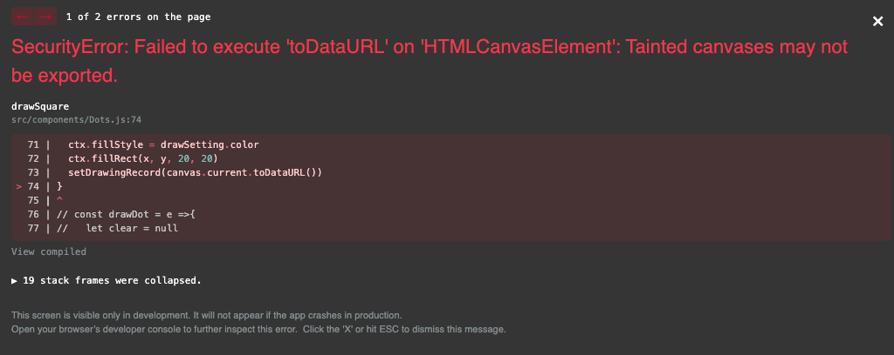
  </p>

### Recording Hex Colour Codes

To record the hex colour codes, I first made an array of 256 blank strings:

```
  const [dots, setDots] = React.useState(Array(256).fill(''))
```

Then, it was a case of adding lines below into the drawing function, pushing the hex code into the relevant index of the dots array, setting it to state.

```
dots[e.target.id] = drawSetting.color
setDots(dots)
```

This would give me an array like below. I was able to send this to the database as strings by using `JSON.stringify()`. To reuse data, it can changed back to array with `JSON.parse()`.

 <p align="center">
	  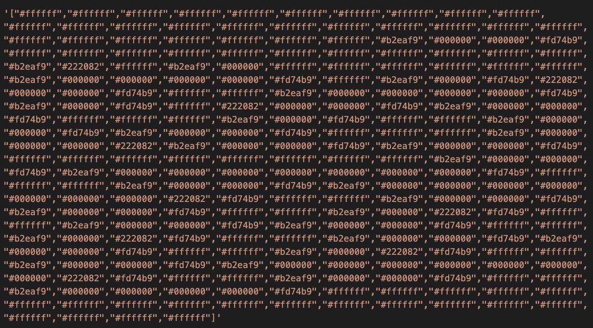
  </p>

Once I had this array, I realised that I could draw without using canvas by replacing ` ctx.fillRect(x, y, 20, 20)` with `e.target.style.backgroundColor = drawSetting.color`. This was lot simpler because I didn't even have to specify the coordinate. Also, if the grid was rerendered due to any change on the page, the divs could be coloured again by referring to the hex codes stored in the 'dots' array:

```
const drawIntoGrid = (sourceDots, target) =>{
  sourceDots.forEach((dot, i)=>{
    target.current.children[i].style.backgroundColor = dot
  })
}
```

I also had the idea to store the colour palette of the image on the database. The colour palette would be derived from the 'dots' array by sorting the hex codes in order of prevalence, then removing duplicates. 

```
const sortedByFrequencyDuplicatesAndBlankRemoved = array =>{  
  const countOccurrences = (arr, val) => arr.reduce((a, v) => (v === val ? a + 1 : a), 0)
  const blankRemoved = array.filter(dot=> dot !== '' && dot)
  const orderedByFrequency = blankRemoved.map(ele=>{  
    return `${ele}_${countOccurrences(blankRemoved,ele)}`
  }).sort((a, b) => b.split('_')[1] - a.split('_')[1])  
  return [ ...new Set(orderedByFrequency.map(ele=>ele.split('_')[0]))]
}
```

For simplicity, I also limited the palette to 8 colours with function below:

```
  const filterPalette = arr =>{
    const palette = Array(8).fill('')
    for (let i = 0; i < 8; i++){
      palette[i] = sortedByFrequencyDuplicatesAndBlankRemoved(arr)[i]
    }
    return palette
  }
```  

Having the data for the colour palette allowed me to map them onto various part of the website, like below:
 <p align="center">
	  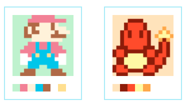
  </p>

Arguably, I no longer needed the canvas, since I could draw with the divs and redraw the images with the hex colour code. However, I left the canvas in since having the url for png image useful for rendering thumbnail images.

<br/>

## Setting up the Backend

Once I tested the basic drawing functionality and identified what kind of data I wanted on the database, I worked on setting up the backend.
### User Model

After setting up the boiler-plate Django, the first thing I set up was the user model. I used the default user model that comes with Django, but made slight customisation. I eventually added a many-to-many relationship to itself to add the 'followed_by' and 'following' field, but other than this left the user model basic since the Django user model came complete with enough features, including password verification.

```
from django.db import models
from django.contrib.auth.models import AbstractUser

class User(AbstractUser):
    email = models.CharField(max_length=50, unique=True)
    profile_image = models.CharField(max_length=300)

```    

### Pics and Categories Model

The drawings to be stored on the database had the following model:

```
from django.db import models

class Pic(models.Model):
    title = models.CharField(max_length=50)
    image = models.CharField(max_length=300)
    description = models.TextField(max_length=200, null=True, blank=True)
    dots = models.TextField(max_length=3100)
    color_palette = models.TextField(max_length=100)
```    

I eventually added relationships below to the model. I made another model for categories, which simply had a field for the category name (the id would be defined automatically by Django). To keep the project simple, I didn't add a functionality to enable user to add their own category this time. Users could 'like' the pixel art, and this would be stored in the database as 'favourited_by'.

```
    categories = models.ManyToManyField(
        "categories.Category",  
        related_name="pics"
    )  
    artist = models.ForeignKey(
        "jwt_auth.User",
        related_name="created_pic",
        on_delete=models.CASCADE
    )
    favorited_by = models.ManyToManyField(
        "jwt_auth.User",
        related_name="favorited_pic",
        blank=True
    )
```

The functionality for favouriting the pixel art was defined in the views.py. I was going to change the icon displayed on the frontend depending on if the pixel art was favourited or not, so I settled with having two separate definitions rather than having just one to toggle the status.

```
class PicFavoriteView(PicDetailView):

    permission_classes = (IsAuthenticated, )

    def post(self, request, pk):
        pic_to_favorite = self.get_pic(pk=pk)
        pic_to_favorite.favorited_by.add(request.user.id) 
        pic_to_favorite.save()
        serialized_favorited_pic = PopulatedPicSerializer(pic_to_favorite)
        return Response(serialized_favorited_pic.data, status=status.HTTP_201_CREATED)


    def delete(self, request, pk):
        pic_to_unfavorite = self.get_pic(pk=pk)
        pic_to_unfavorite.favorited_by.remove(request.user.id) 
        pic_to_unfavorite.save()
        serialized_favorited_pic = PopulatedPicSerializer(pic_to_unfavorite)
        return Response(serialized_favorited_pic.data, status=status.HTTP_204_NO_CONTENT)        
```


### Comments Model

Comments were given its own model, then hooked up with the users and pics models with one-to-many relationship.

```
class Comment(models.Model):
    text = models.TextField(max_length=200)
    rating = models.PositiveIntegerField()
    created_at = models.DateTimeField(auto_now_add=True)
    pic = models.ForeignKey(
        "pics.Pic",
        related_name="comments",
        on_delete=models.CASCADE
    )
    owner = models.ForeignKey(
        "jwt_auth.User",
        related_name="posted_comments",
        on_delete=models.CASCADE
    )
```    
I spent one whole day setting up the backend, testing as I went using Django's inbuilt admin page and insomnia. Once the backend was functional, I set up React to work on the frontend - once I moved onto this stage I made minor tweaks in the backend, mainly to alter what data was visible from where by changing the settings on the serializers. 

I added some users using a seed data loaded with `python manage.py loaddata jwt_auth/seeds.json` command, but this time I couldn't create the seed data for the pixel art in advance, since it needed the hex colour code arrays. These were easier to produce using the drawing function in the website. Due to the nature of Django, it was easier to set up compared to Mongo and Express, however I did find that there were less freedom with Django's seeding process.

 <p align="center">
	  
  </p>

Favouriting

Following 

Commenting

Other Drawing Features (Forking)
### Home Animation

//* set string length limits for data string?

3075 characters


## Final Thoughts

Heavy lifting in the backend or frontend?

### Wins and Challenges
It was the first time for me to make a web app in pairs, and I was still relatively new to working with React and API, so there was a lot to take in. On top of this we only had 48 hours so it was a major task. 

At the beginning it took longer to get started because we had to calibrate out ideas, but the process helped make the concept clearer, and in the end I was able to achieve much more than I could on my own. I felt that splitting the task worked well, because I was able to focus a lot on styling. 

We chose to use Bulma for some of the CSS. I found myself fighting against Bulma at times, but it was useful for getting things into shape quickly, such as the stats bar and form fields. Having said this, if I were to make something similar in the future, I would probably write my own CSS to have better control.

<br />

### Key Learnings